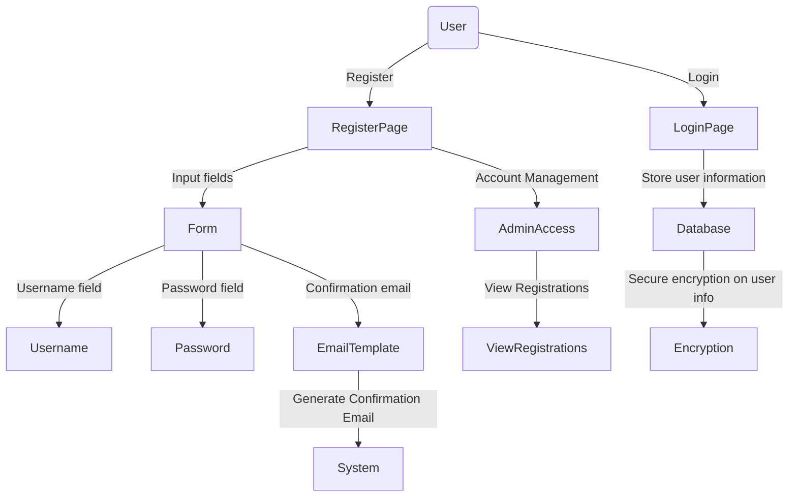

identify the user stories from ![[Requirement - User Registration]]

As an unregistered user, I want to register for a new account so that I can access the website's features.

As a user, I want to be able to provide my personal information during the registration process so that I can create a personalized account.

As a user, I want to be able to set a username and password during the registration process so that I can login to my account in the future.

As a user, I want to receive a confirmation email after registering so that I can verify my account and start using the website.

As an administrator, I want to be able to manage and view all user registrations so that I can monitor activity and prevent unauthorized access. 

generate a detailed list of the components of the system 

-Database to store user information 
-Registration page
-Login page
-Forgot Password page
-Input fields to capture user personal information 
-Username field 
-Password field 
-Confirmation email template 
-Account management page -Admin access to view all registrations 
-Secure encryption on stored user information 
-System to generate confirmation emails

generate a c4 style component diagram in detail in mermaid script 

generate a list of microservices in detail 

1. User Registration Service 
2. User Login Service 
3. User Authentication Service 
4. User Information Storage Service 
5. Email Confirmation Service 
6. User Account Management Service 
7. Database Encryption Service 
8. User Password Reset Service

generate a detail list of functions for each microservice 

1. User Registration Service 
 - Receive user input for registration
 - Validate user data to meet system requirements
 - Generate and store a secure password
 - Create a unique user ID
 - Send out a confirmation email
 - Store user data in the database
 
2. User Login Service 
 - Accept user credentials 
 - Validate the credentials against the stored user data 
 - Retrieve user details from the database 
 - Send a token to authenticate the user 
 
3. User Authentication Service 
 - Verify the token sent by the user 
 - Authorize and grant access to the requested service 
 - Generate and store a new token when the user logs in again 
 
4. User Information Storage Service 
 - Receive user profile information 
 - Validate data to meet system requirements
 - Store data securely in the database
 - Encrypt sensitive information 
 
5. Email Confirmation Service 
 - Send an email to the user's address 
 - Generate a verification code 
 - Verify the code when received from the user 
 - Activate the user account if valid code is provided
 
6. User Account Management Service 
 - Allow users to update their profile information 
 - Generate and store new passwords when requested by user 
 - Block users from logging in when suspicious activities are detected 
 - Monitor and track user activities on the system for security purposes 
 
7. Database Encryption Service 
 - Encrypt all sensitive information stored in the database 
 - Decrypt data when requested by the user or other services 
 - Generate and store encryption keys securely 
 
8. User Password Reset Service 
- Allow users to reset their passwords securely 
- Generate a new, secure password for the user 
- Send an email containing the new password to the user's address 
- Store new passwords securely in the database

generate a data model in detail for each microservice 

1. User Registration Service
Data Model:

Users Table 
- id (primary key) 
- name 
- email 
- password_hashed 
- created_at 
- updated_at 

2. User Login Service 
Data Model:

Users Table 
- id (primary key) 
- name 
- email 
- password_hashed 
- token (string) 
- created_at 
- updated_at 

3. User Authentication Service 
Data Model:

Tokens Table 
- id (primary key)
- user_id (foreign key)
- token (string) 
- created_at 
- expires_at 

4. User Information Storage Service 
Data Model: 

Profiles Table 
- id (primary key) 
- user_id (foreign key) 
- name 
- address 
- phone_number 
- profile_data (text) 
- created_at 
- updated_at 

5. Email Confirmation Service 
Data Model: 

Verifications Table 
- id (primary key) 
- user_id (foreign key)  
- code (string)  
- verified_at (datetime) 
- created_at (datetime)  
- expired_at (datetime) 
  
6. User Account Management Service 
Data Model: 
  
Accounts Table  
- id (primary key)  
- user_id (foreign key)  
- status (string)  
- last_login_at (datetime)  
- blocked_at (datetime)  
- created_at (datetime)  
- updated_at (datetime)  

  
7. Database Encryption Service 
Data Model:  

Encryption Keys Table  
- id (primary key)  
- user_id (foreign key)  
- key (string)  

  
8. User Password Reset Service  
Data Model:    
    
Password Resets Table    
- id (primary key)    
- user_id (foreign key)    
- password_hashed (string)    
- reset_at (datetime)

generate a class diagram in detail 
Class Diagram:

Class: User
  - id (primary key) 
  - name 
  - email 
  - password_hashed 
  - created_at 
  - updated_at 
  + getUser()
  + setPassword()
  + resetPassword()
  + confirmEmail()
  
Class: Token
  - id (primary key)
  - user_id (foreign key)
  - token (string) 
  - created_at 
  - expires_at 
  + getToken()
  
Class: Profile  
  - id (primary key) 
  - user_id (foreign key) 
  - name 
  - address 
  - phone_number 
  - profile_data (text) 
  - created_at 
  - updated_at  
   + getProfileData()  
   + setProfileData()  
     
Class: Verification  
  - id (primary key) 
  - user_id (foreign key)  
  - code (string)  
  - verified_at (datetime) 
  - created_at (datetime)  
  - expired_at (datetime)   
   + verify()   
   + confirmVerification()   
     
Class: Account  
- id (primary key)  
- user_id (foreign key)  
- status (string)  
- last_login_at (datetime)  
- blocked_at (datetime)  
- created_at (datetime)  
- updated_at (datetime)  
+ getAccountStatus()  
+ blockAccount()  

    
Class: EncryptionKey  
- id (primary key)  
- user_id (foreign key)  
- key (string)  
+ generateKey()  

    Class: PasswordReset   
- id (primary key)    
- user_id (foreign key)    
- password_hashed (string)    
- reset_at (datetime)    
+ resetPassword()

