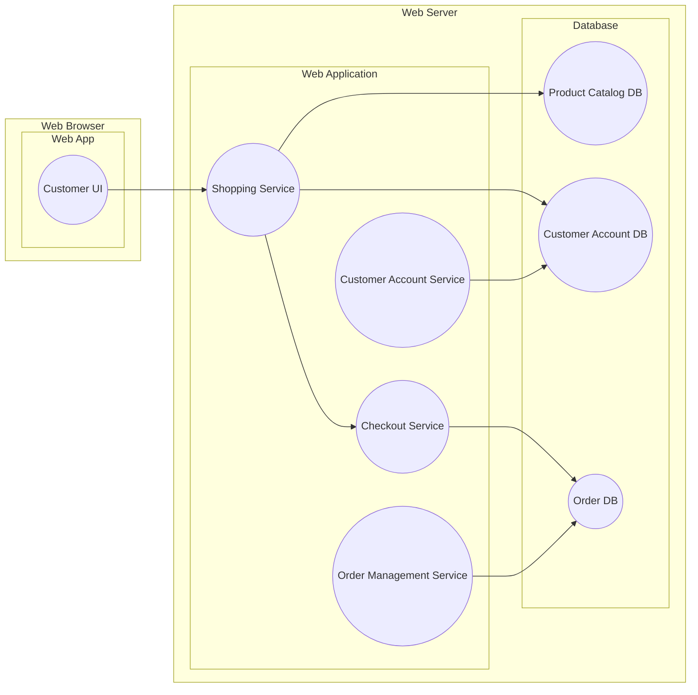

Tags: #Mermaid/C4Container

```mermaid
flowchart LR
  subgraph "Web Browser"
    subgraph "Web App"
      CustomerUI((Customer UI))
    end
  end

  subgraph "Web Server"
    subgraph "Web Application"
      ShoppingService((Shopping Service))
      CheckoutService((Checkout Service))
      CustomerAccountService((Customer Account Service))
      OrderManagementService((Order Management Service))
    end

    subgraph "Database"
      ProductCatalogDB((Product Catalog DB))
      CustomerAccountDB((Customer Account DB))
      OrderDB((Order DB))
    end
  end

  CustomerUI --> ShoppingService
  ShoppingService --> ProductCatalogDB
  ShoppingService --> CustomerAccountDB
  ShoppingService --> CheckoutService
  CheckoutService --> OrderDB
  OrderManagementService --> OrderDB
  CustomerAccountService --> CustomerAccountDB

```
