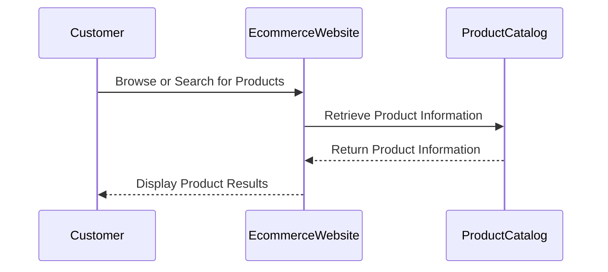

Tags: #Requirements/Functional #User_Story #Example 
Links: [[eCommerce Website Example - Functional Requirements]]

As a customer looking to purchase products on the ecommerce website, I want to easily browse and search for products so that I can quickly find what I'm looking for. I expect to be able to browse products by category, filter them by relevant attributes such as price range, brand, and ratings, and sort them by relevance or popularity. Additionally, I expect to be able to perform keyword searches across the entire product catalog, and to receive relevant search results with clear product images and descriptions. I also expect to be able to save items I am interested in to my wishlist, so that I can easily find and purchase them later.

## Sequence Diagram

