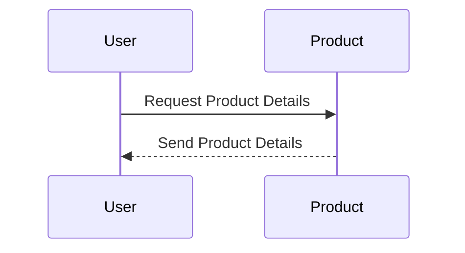

```tg
Generate sequence diagram for this ![[Requirement - Product Details]] in mermaid script 
```





```tg
Generate sequence diagram for this ![[Requirement - Shopping Cart]] in mermaid script 
```

```mermaid
sequenceDiagram

    participant User

    participant System

    User->>System: Initiate Shopping Cart

    System-->>User: Select Item or Add Item

    loop Item Added

        User->>System: Add Item

        System-->>User: Item Added

    end

    User->>System: Checkout Items

    System-->>User: Confirm Payment

    User->>System: Confirm Payment

    System-->>User: Payment Confirmation Done

    User->>System: Shopping Cart Closed
   ```

