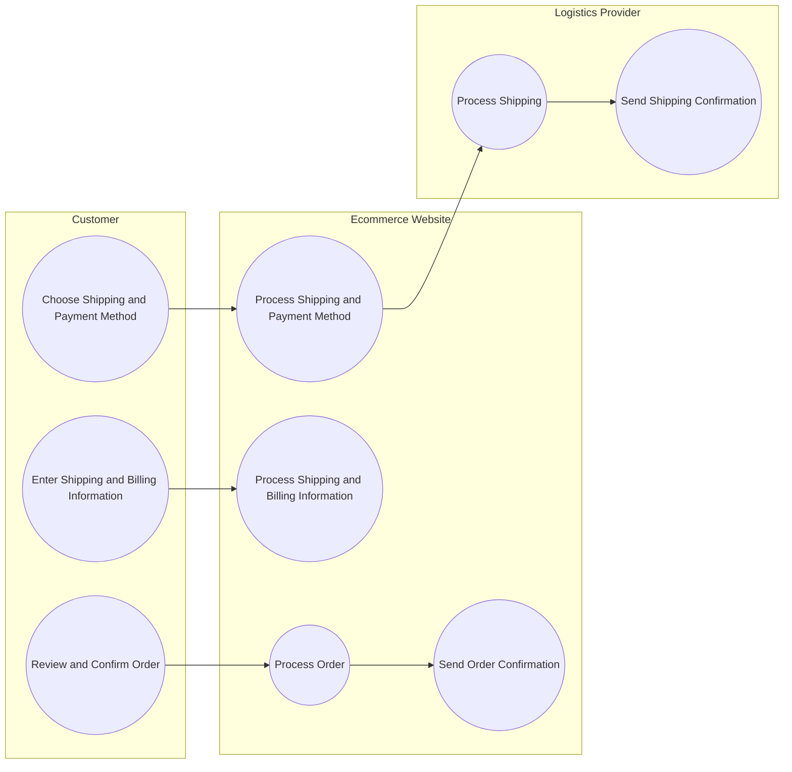
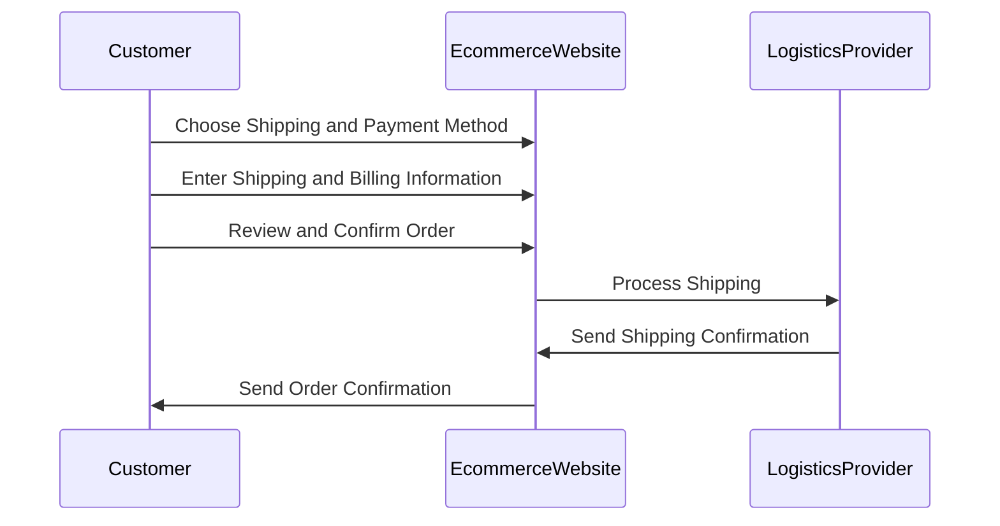

Tags: #Requirements/Functional #User_Story #Example 
Links: [[eCommerce Website Example - Functional Requirements]]

As a customer ready to complete my purchase on the ecommerce website, I want to be able to easily and securely checkout so that I can receive my products in a timely manner. I expect to be able to select my preferred shipping and delivery options, and to see the estimated delivery date and shipping costs. I also expect to be able to securely provide my billing and payment information, including the option to save my payment information for future purchases. Additionally, I expect to receive a detailed order summary with an order number and confirmation of my purchase, including any applicable discounts or promotions. Finally, I expect to be able to receive updates on my order status, including shipping and delivery updates, via email or SMS.

## Flowchart

## Sequence Diagram

