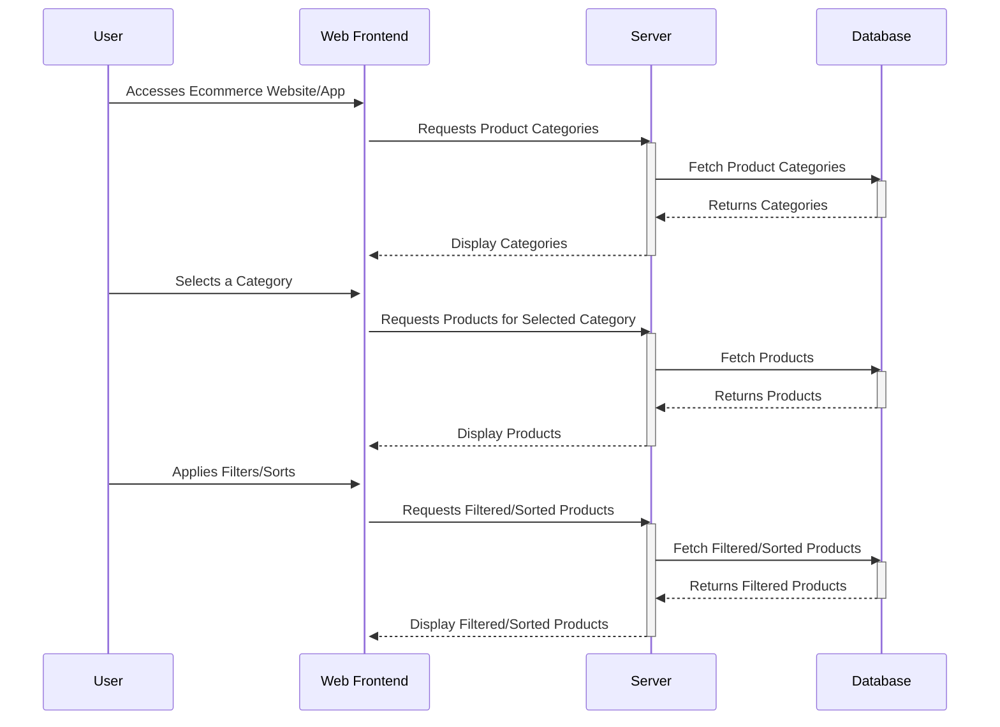

---
tags:
  - System/Ecommerce
  - Example
---
# Description

**Product Browsing Services**

Introducing our state-of-the-art Product Browsing Services, tailored to provide a seamless and enriching online shopping experience. Dive into a vast array of products organized meticulously into intuitive categories, ensuring you find precisely what you're seeking.

Key Features:
- **Intuitive Navigation**: Easily journey through diverse categories, from electronics to fashion, ensuring you spot items relevant to your interest.
- **High-Resolution Imagery**: Each product showcases clear, high-quality photos from multiple angles, giving you a near-tangible feel of what you're about to purchase.
- **Detailed Descriptions**: Get informed with comprehensive product details, from specifications to dimensions, ensuring you make well-informed decisions.
- **Filter & Sort**: Refine your search with our advanced filters, allowing you to narrow down choices by brand, price, ratings, and more. Plus, sort products based on popularity, price, or newest arrivals to match your preference.
- **Interactive UI**: With a responsive design, our platform effortlessly adapts to all screen sizes, ensuring a consistent browsing experience whether you're on a desktop, tablet, or mobile.
- **Personalized Recommendations**: As you browse, our system learns your preferences and suggests products tailored to your tastes, ensuring you don't miss out on potential favourites.

Experience shopping like never before. Dive into a world of options, get informed, and discover products that resonate with your needs and desires. Happy browsing!

# Sequence Diagram

# Requirements

### Functional Requirements

1. **Homepage Display**:
    - R1.1: Display a list of top product categories on the homepage.
    - R1.2: Showcase featured products, deals, or new arrivals on the homepage.

2. **Category Browsing**:
    - R2.1: Allow users to view all available product categories.
    - R2.2: Each category should display a representative image and a short description.

3. **Product Listing**:
    - R3.1: List products in a grid or list view within selected categories.
    - R3.2: Each product listing should display the product image, name, price, and average rating.
    - R3.3: Offer pagination for product listings exceeding a certain number (e.g., more than 50 products per page).

4. **Product Filtering**:
    - R4.1: Allow users to filter products by various attributes (e.g., brand, size, color, price range).
    - R4.2: Display a count of products matching the current filter criteria.
    - R4.3: Ensure quick response time for filter applications.

5. **Product Sorting**:
    - R5.1: Provide users the ability to sort products based on attributes like popularity, newest arrivals, customer reviews, or price.
    - R5.2: Remember user’s last sorting preference during their browsing session.

6. **Product Details**:
    - R6.1: Display detailed product information upon selecting a product, including high-resolution images, detailed description, specifications, and customer reviews.
    - R6.2: Allow zoom-in functionality for product images.
    - R6.3: Show related or similar product recommendations on the product details page.

7. **Responsive Design**:
    - R7.1: Ensure the browsing service is responsive, adapting to various screen sizes including desktop, tablet, and mobile devices.
    - R7.2: Images and text should re-size and re-align depending on the screen size.

---

### Architecture Characteristics

1. **Performance**:
    - N1.1: Product listings should load within 2 seconds.
    - N1.2: Filter and sort operations should reflect changes in under 1 second.

2. **Usability**:
    - N2.1: The user interface should be intuitive, with clear navigation cues.
    - N2.2: Tooltips or help sections should be available to guide first-time users.

3. **Accessibility**:
    - N3.1: The product browsing service should be accessible, catering to users with disabilities.
    - N3.2: Ensure compatibility with screen readers and provide alternative text for images.

4. **Scalability**:
    - N4.1: The service should handle a large number of concurrent users without degradation in performance.
    - N4.2: Product database scalability should be ensured to accommodate growing product listings.

5. **Security**:
    - N5.1: Ensure protection against SQL injection, cross-site scripting, and other common web vulnerabilities.
    - N5.2: Ensure secure data transmission using HTTPS.

6. **Availability**:
    - N6.1: Aim for 99.9% uptime for the product browsing services.

