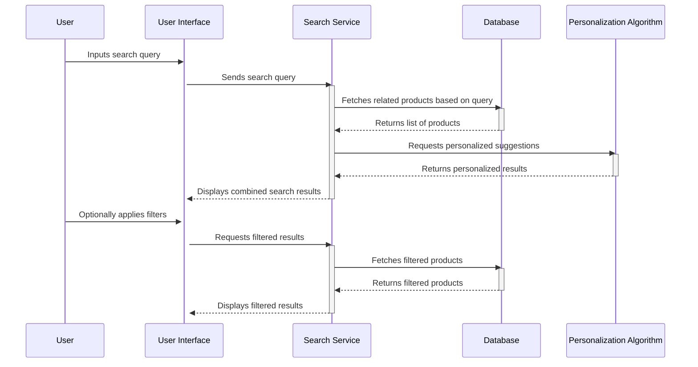

---
tags:
  - System/Ecommerce
  - Example
---
# Description

**Search Functionality Service**

Experience the pinnacle of online shopping efficiency with our advanced Search Functionality Service. Our service is meticulously engineered to comprehend your needs, ensuring you swiftly find exactly what you're looking for amidst a vast array of products.

Key Features:
- **Real-time Search**: As you type, get instantaneous product suggestions, guiding you to your desired items without waiting.
- **Intelligent Algorithms**: Benefit from a search system that learns from your preferences, frequently searched terms, and popular products, continuously improving its suggestions for you.
- **Advanced Filters**: Post-search, fine-tune your results with filters like price range, brand, category, ratings, and more, allowing you to pinpoint your desired item.
- **Semantic Understanding**: Even if you misspell a word or use related terms, our search has got you covered! It understands context, synonyms, and common misspellings, ensuring you're always on the right track.
- **Relevant Product Highlights**: Along with product names, see key highlights like prices, discounts, and star ratings in the search results.
- **Search History & Personalization**: Access your recent searches and receive personalized product suggestions based on your browsing and search history.

Harness the power of a dynamic, user-centric search experience. Whether you have a clear idea of what you want or are just browsing, our Search Functionality Service will guide you effortlessly to your desired products. Dive in and discover with ease!

# Sequence Diagram

# Requirements

### Functional Requirements

1. **Search Input**:
    - R1.1: Provide an easily accessible search bar on all pages.
    - R1.2: Support auto-complete suggestions based on popular searches and user's search history.

2. **Search Execution**:
    - R2.1: Return search results rapidly, ideally within 2 seconds.
    - R2.2: Display a message when no results match the search criteria.

3. **Search Results**:
    - R3.1: Present results with product images, names, prices, and average ratings.
    - R3.2: Offer pagination if search results exceed a certain number per page.
    - R3.3: Highlight the searched term in the results.

4. **Advanced Filters**:
    - R4.1: Provide advanced filtering options post-search, like brand, category, price range, and ratings.
    - R4.2: Display the number of items matching the filter criteria.

5. **Semantic Understanding**:
    - R5.1: Return relevant results for misspelled words by suggesting "Did you mean [corrected word]?".
    - R5.2: Recognize and process synonyms or related terms in searches.

6. **Search History**:
    - R6.1: Store and display the user's recent search terms for easy access.
    - R6.2: Allow users to clear their search history.

7. **Personalized Suggestions**:
    - R7.1: Use browsing history and previous searches to tailor search auto-complete suggestions.
    - R7.2: Offer an option to opt out of personalized search suggestions.

---

### Architecture Characteristics 

1. **Performance**:
    - N1.1: Ensure search results load within 2 seconds of the query submission.
    - N1.2: Ensure filtering operations reflect changes in under 1 second.

2. **Usability**:
    - N2.1: The search bar and filters should be intuitive and easy to use.
    - N2.2: Provide tooltips or help icons to explain advanced filters.

3. **Accessibility**:
    - N3.1: Ensure that the search functionality is keyboard navigable.
    - N3.2: Ensure compatibility with screen readers.

4. **Scalability**:
    - N4.1: Ensure the search functionality can handle a surge in simultaneous search queries without degradation in performance.
    - N4.2: The system should scale with the addition of new products and categories.

5. **Security**:
    - N5.1: Safeguard against SQL injection and other search-related vulnerabilities.
    - N5.2: Ensure that search history and personalized data are stored securely.

6. **Availability**:
    - N6.1: Strive for high availability of the search service, targeting at least 99.9% uptime.

---

These requirements serve as a foundation for the development and implementation of the Search Functionality Service. They provide a detailed roadmap for both the functional and non-functional aspects of the service, ensuring a robust and user-friendly experience.