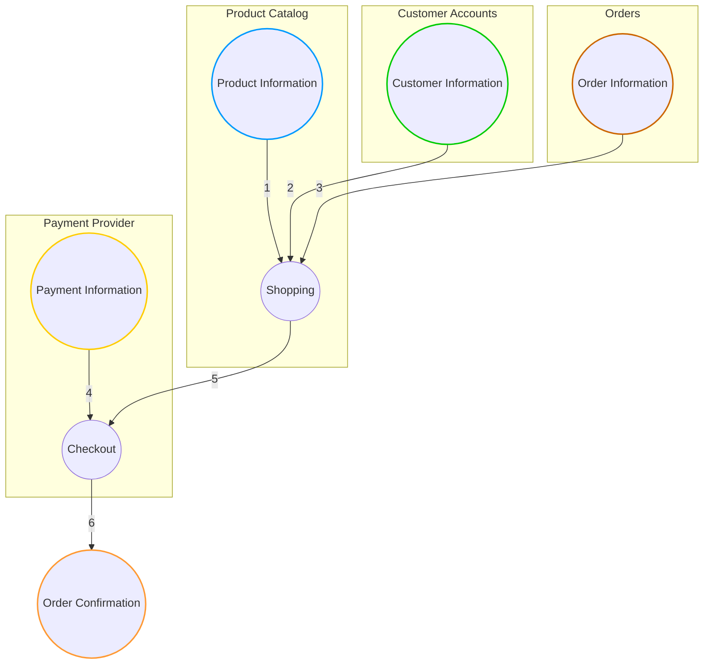

Tags: #Mermaid/DFD

```mermaid
graph TD
  subgraph "Product Catalog"
    A((Product Information)) -->|1| B((Shopping))
  end

  subgraph "Customer Accounts"
    C((Customer Information)) -->|2| B
  end

  subgraph "Orders"
    D((Order Information)) -->|3| B
  end

  subgraph "Payment Provider"
    E((Payment Information)) -->|4| F((Checkout))
  end

  B -->|5| F
  F -->|6| G((Order Confirmation))

  style A stroke:#0099ff,stroke-width:2px
  style C stroke:#00cc00,stroke-width:2px
  style D stroke:#cc6600,stroke-width:2px
  style E stroke:#ffcc00,stroke-width:2px
  style G stroke:#ff9933,stroke-width:2px


```

